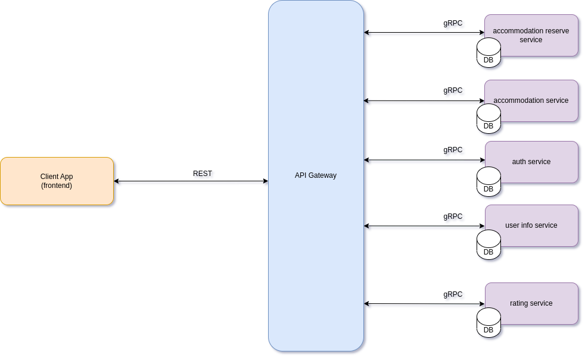

# Accommodation-Booking-Webapp

## Table of contents
* [General info](#general-info)
* [Technologies](#technologies)
* [App Architecture](#app-architecture)
* [Setup](#setup)

## General info
The Accommodation-Booking-Webapp is a web application that allows users to book accommodations for their travel needs. The application supports different user roles, including Unauthenticated User (NK), Host (H), and Guest (G), each with specific functionalities and permissions.

Unauthenticated User (NK)
Unauthenticated Users have limited access to the application. They can create a new host or guest account or sign in to an existing account. Additionally, they can search for accommodations but cannot make reservations or create new listings.

Host (H)
Hosts have the ability to create and manage accommodations. They can define the amenities, availability periods, and pricing for each accommodation. Hosts can choose whether the property can be automatically booked or only with their approval. On their account, hosts can view and search for all accommodations but cannot make reservations.

Guest (G)
Guests can make reservations for accommodations. They can also cancel any reservation or reservation request before its start date. Guests have the functionality to rate accommodations and host accounts.

Featured Host (roles: H)
A Featured Host is a special status that a host can achieve by meeting the following criteria:

Has a rating greater than 4.7
Has a cancellation rate lower than 5%
Has had at least 5 past reservations
The total duration of all reservations is greater than 50 days
If a host meets these criteria, their profile will display the Featured Host status. This status is not permanent and can change based on the host's performance

## App Architecture

The Accommodation-Booking-Webapp follows a microservices architecture for its back-end. This architecture allows for better scalability, flexibility, and maintainability of the system. Each microservice handles a specific functionality or domain of the application. The front-end provides the user interface through which users can interact with the system.

<figure>
  
  <figcaption align = "center"><i>Diagram: Accommodation booking webapp</i></figcaption>
</figure>

The diagram above illustrates the system architecture of the Accommodation-Booking-Webapp. It shows how the different components and services interact with each other to deliver the desired functionality.

## Technologies
Project is created with:
* golang:  1.19
* @angular/core:     15.2.5

## Setup
 * Backend(do it from root directory):
   1. docker-compose build
   2. docker-compose up
 * Frontend(do it from root 'frontend/accommodation-booking/'):
   1. npm install
   2. npm start

